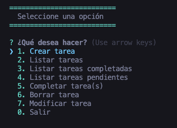
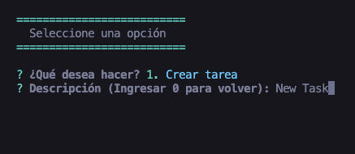
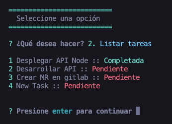
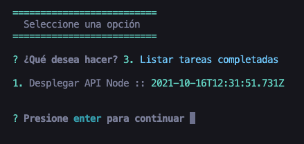
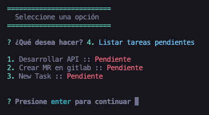
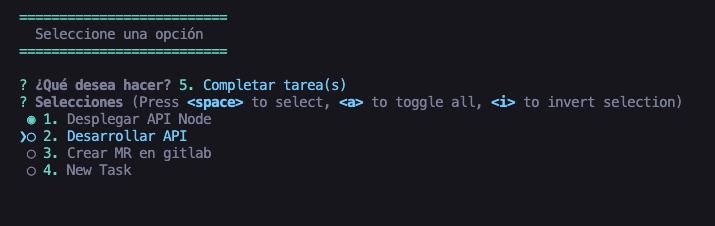
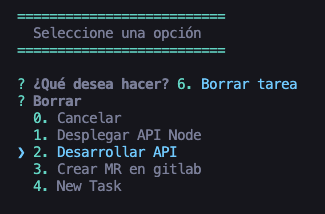
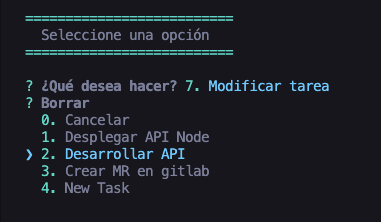

# Console App Of Tasks

A simple console App to manage tasks

## Description

In this app I use `inquirer` to handle tasks in the console.

## Getting Started

### Dependencies

- `npm`
- `node`

### Installing

- Clone the repository and install dependencies:

```
git clone https://github.com/Felipe-Navas/console-app-of-tasks.git && cd console-app-of-tasks && npm install
```

### Executing program

```
npm start
```

Preview of the principal menu:



Preview of create task:



Preview of list task:



Preview of completed task:



Preview of pending task:



Preview of complete task:



Preview of delete task:



Preview of modify task:



### Running tests

```
npm test
```

## Authors

- [Felipe Navas](https://www.linkedin.com/in/felipenavaslederhos) - [Email](mailto:felipenavas.itec@gmail.com?subject=[GitHub]%20console-app-of-tasks)

## Contributing

1. Fork it (<https://github.com/Felipe-Navas/console-app-of-tasks/fork>)
2. Create your feature branch (`git checkout -b feature/fooBar`)
3. Commit your changes (`git commit -am 'Add some fooBar'`)
4. Push to the branch (`git push origin feature/fooBar`)
5. Create a new Pull Request

## License

This project is licensed under the [MIT License] - see the LICENSE file for details
